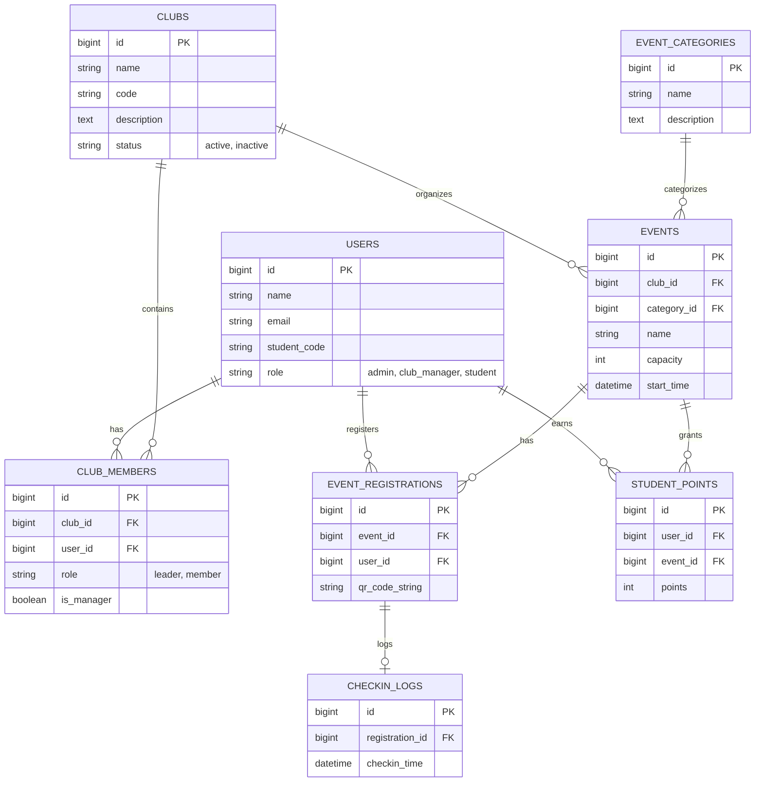

# ĐỀ TÀI 5: QUẢN LÝ CÂU LẠC BỘ, SỰ KIỆN VÀ ĐIỂM HOẠT ĐỘNG SINH VIÊN

> **Hệ thống Quản lý Câu lạc bộ & Điểm hoạt động Sinh viên - TLU Club Manager**  
> **Nhóm thực hiện:** Nhóm 12 - CSE  
> **Repository GitHub:** [https://github.com/HungDo122/Nhosm12_CSE](https://github.com/HungDo122/Nhosm12_CSE)

---

## 🛠 Công Nghệ Sử Dụng (Tech Stack)
- **Backend Framework:** PHP 8.2+ / Laravel 11
- **Database:** SQLite / MySQL
- **Frontend / UI:** Blade Templates, Bootstrap 5, FontAwesome 6
- **Authentication & Authorization:** Custom Middleware `CheckRole` (Admin, Club Manager, Student)
- **Diagram Tool:** Mermaid.js ERD

---

## 📊 Sơ Đồ Cơ Sở Dữ Liệu (ERD)



---

## 🚀 Hướng Dẫn Chạy Ứng Dụng (Local Setup)

### 1. Clone Repository & Cài đặt gói phụ thuộc
```bash
git clone https://github.com/HungDo122/Nhosm12_CSE.git
cd Nhosm12_CSE
composer install
npm install
```

### 2. Cấu hình môi trường (.env)
```bash
cp .env.example .env
php artisan key:generate
```

### 3. Khởi tạo Cơ sở dữ liệu & Nạp dữ liệu mẫu (Seeder)
```bash
php artisan migrate:fresh --seed
```

### 4. Khởi chạy Server
```bash
php artisan serve
```
Truy cập ứng dụng tại địa chỉ: `http://127.0.0.1:8000`

---

## 🔑 Tài Khoản Dùng Thử (Default Credentials)

| Vai trò | Email | Mật khẩu | Mã SV |
| :--- | :--- | :--- | :--- |
| **Quản trị viên (Admin)** | `admin@tlu.edu.vn` | `123456` | ADMIN001 |
| **Chủ nhiệm CLB IT** | `it.cn@tlu.edu.vn` | `123456` | A35001 |
| **Chủ nhiệm CLB Âm nhạc** | `music.cn@tlu.edu.vn` | `123456` | A35002 |
| **Sinh viên 1** | `student1@tlu.edu.vn` | `123456` | A36101 |
| **Sinh viên 2** | `student2@tlu.edu.vn` | `123456` | A36102 |

---

## 👥 Phân Công Module Trong Nhóm
- **Thành viên A:** Quản lý Người dùng (`users`), Quản lý Câu lạc bộ (`clubs`), Thành viên CLB (`club_members`), Danh mục sự kiện (`event_categories`), Phân quyền Middleware.
- **Thành viên B:** Quản lý Sự kiện (`events`), Đăng ký tham gia (`event_registrations`), Điểm danh QR (`checkin_logs`), Điểm hoạt động (`student_points`).
